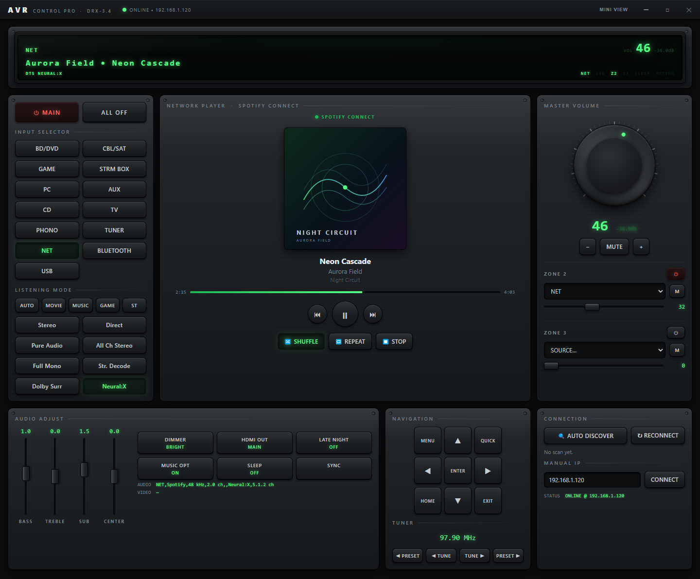
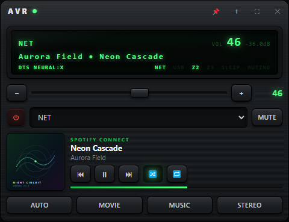

# AVR Control Pro

A Windows desktop app that controls Integra and Onkyo network receivers over IP, with a
live replica of the receiver's front-panel display, full control of every input, zone,
listening mode and trim, and Spotify Connect track info with album art.

**[Landing page →](https://lgbtnewsradio-sudo.github.io/avr-control-pro/)** · **$5.99 on the
Microsoft Store** (listing in certification)



Built and tested against an **Integra DRX-3.4**. Other Integra and Onkyo network
receivers use the same eISCP protocol and are likely to work, but are untested.

---

## What it does

- **Finds the receiver by itself** — UDP discovery on launch, manual IP entry as a
  fallback, and it remembers what it found.
- **Front-panel replica** — source, scrolling track/station line, volume in dB, and the
  indicator lamps (listening mode, NET/USB, Zone 2/3, sleep, muting) — in both views.
- **Every input and listening mode** — 13 source selectors, quick modes, and direct
  picks like Pure Audio, Neural:X, All Channel Stereo and Full Mono.
- **Master volume** — draggable machined knob, scroll wheel, or step buttons, with the
  receiver's own dB readout and mute.
- **Zone 2 and Zone 3** — power, source, volume and mute for each.
- **Tone and setup** — bass, treble, subwoofer and centre on vertical faders in half-dB
  steps, plus dimmer, HDMI output, Late Night, Music Optimizer and sleep timer.
- **Spotify Connect** — cover art, title, artist, album, progress, and full transport
  (play/pause, skip, shuffle, repeat, stop). No Spotify login: the receiver reports it.
- **Mini view** — compact always-on-top window that collapses to just the display and
  volume strip.
- **Honest connection state** — the status lamp goes green only after the receiver
  actually answers, and the app reconnects on its own if the link goes quiet.
- **No cloud, no account** — direct eISCP on your LAN.

## Two views

| Full window | Mini window |
| --- | --- |
|  |  |

Screenshots show sample playback data; the cover art in them is an original graphic, not
a real album.

---

## Running from source

The source is published so you can see exactly what the app does on your network, and so
you can build it for your own use. It is not open source — see [Licence](#licence).

```bash
npm install
npm start
```

If Electron's binary fails to download during `npm install` (common on restricted
networks), fetch `electron-v<version>-win32-x64.zip` from the
[Electron releases](https://github.com/electron/electron/releases), extract it into
`node_modules/electron/dist`, and write `electron.exe` into
`node_modules/electron/path.txt`.

## Building

```bash
npm run dist         # NSIS installer  → dist/*.exe
npm run dist:store   # Store MSIX      → dist/*.msix
npm run icons        # regenerate app icon + Store tiles
npm run shots        # regenerate docs screenshots
```

See [STORE.md](STORE.md) for the Microsoft Store submission checklist — product identity,
the payout and tax profile required for paid apps, price tier, and the free trial.

---

## How it works

Control runs over **eISCP**, the Integra/Onkyo protocol, on TCP port 60128. Discovery is
a UDP broadcast of `ECNQSTN` on the same port.

Two behaviours are worth knowing about, both learned from a live DRX-3.4:

- **Tone and level values are in half-decibel units.** A reported `+5` is +2.5 dB.
- **Spotify Connect cover art does not arrive over eISCP.** The receiver answers the
  `NJA` artwork request with "no image" and instead serves the current cover from its own
  HTTP endpoint at `/album_art.cgi`. That response also carries a stray CGI header block
  ahead of the JPEG bytes, which has to be stripped before the image will decode.

### Session hygiene

The receiver has very few eISCP control-session slots and does **not** reclaim them from
clients that disappear without closing the connection properly. Exhaust them and it will
accept TCP connections and then answer nothing — while UDP discovery and its web server
keep working normally, which makes it look like the app is broken when the receiver is
the one that's stuck. Only a power cycle clears it (standby is not enough, because the
network module stays powered).

Because of that, this app:

- closes its control session with a proper FIN on exit, and waits for it;
- verifies the receiver actually replies before reporting itself online;
- holds a single-instance lock so two copies never compete for a slot;
- backs off harder when the receiver is mute, instead of hammering it.

## Project layout

```
main/          Electron main process
  eiscp.js       protocol client: framing, discovery, artwork, reconnect logic
  main.js        window management, receiver state model, IPC
  preload.js     context-isolated bridge
renderer/      UI (full + mini views, shared theme and logic)
tools/         icon generation, screenshots, MSIX packaging
docs/          landing page + privacy policy (GitHub Pages)
```

## Licence

Copyright (c) 2026 Mike Moran. All rights reserved. You may read and audit this source,
and build it for your own personal use on hardware you own. Redistributing builds, or
selling this software or derivatives of it, requires written permission. See
[LICENSE](LICENSE) for the exact terms.

Version 1.0.0 was released under the MIT Licence and stays MIT for anyone who obtained
it; this licence governs 1.1.0 onward.

Not affiliated with, endorsed by, or sponsored by Onkyo, Integra, Spotify, or Microsoft;
all trademarks belong to their respective owners.
